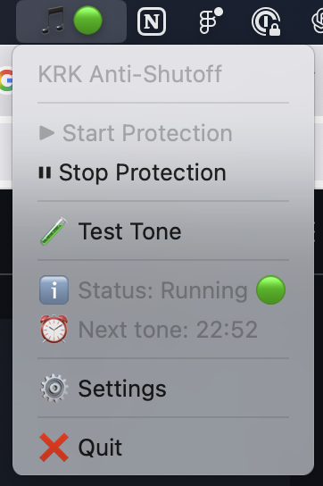

# KRK Rokit Anti-Shutoff - (MacOS)

🎵 Prevent KRK Rokit studio monitors from automatically shutting off by periodically playing an inaudible tone.



## ✨ Features

- 🎛️ **MenuBar App** - Beautiful GUI with system tray icon
- 🔇 **Completely Silent** - Uses 50Hz subsonic frequency (inaudible)
- ⚡ **Optimized Settings** - Pre-configured values that actually work
- 🚀 **Auto-Start** - Launches automatically on system boot
- 🧪 **Test Mode** - Verify functionality before running
- 📊 **Live Status** - Real-time countdown and status updates

## 🎯 Quick Start (Recommended)

### MenuBar App (GUI)
```bash
# Install dependencies
pip3 install --break-system-packages numpy sounddevice rumps

# Run the menubar app
python3 krk_menubar_app.py

# Optional: Install to auto-start on login
./install_menubar_app.sh
```

### Command Line (Traditional)
```bash
chmod +x install_krk_service.sh
./install_krk_service.sh
```

## 🎛️ MenuBar App Usage

The MenuBar app appears as a 🎵 icon in your system tray (top-right corner).

### Controls:
- **▶ Start Protection** - Begin anti-shutoff protection
- **⏸ Stop Protection** - Stop protection (speakers may sleep)
- **🧪 Test Tone** - Play a single test tone
- **ℹ️ Status** - Shows current state (Running 🟢 / Stopped 🔴)
- **⏰ Next tone** - Live countdown to next tone
- **⚙️ Settings** - View current configuration
- **❌ Quit** - Close the application

### Status Indicators:
- 🎵 = App running but protection stopped
- 🎵🟢 = Protection active, monitors staying awake

## 📋 Command Line Usage

### Run once:
```bash
./run_krk.sh
```

### Test that it works:
```bash
python3 krk_anti_shutoff.py --test
```

### Customize configuration:
```bash
# Change interval to 15 minutes
python3 krk_anti_shutoff.py --interval 15

# Change frequency to 20Hz  
python3 krk_anti_shutoff.py --frequency 20

# View all options
python3 krk_anti_shutoff.py --help
```

## 🔧 As Service (Runs Automatically)

### Start service:
```bash
launchctl load ~/Library/LaunchAgents/com.user.krk-anti-shutoff.plist
```

### Stop service:
```bash
launchctl unload ~/Library/LaunchAgents/com.user.krk-anti-shutoff.plist
```

### Check if running:
```bash
launchctl list | grep krk-anti-shutoff
```

### View logs:
```bash
tail -f ~/.krk_anti_shutoff/krk_anti_shutoff.log
```

## ⚙️ Configuration

**Optimized settings (tested and working):**
- Plays a **50Hz** tone (subsonic, completely inaudible)
- For **3.0 seconds** (extended for reliable wake-up)
- Every **25 minutes**
- At **0.8 volume** (higher volume for reliable detection)

You can change these values with parameters:
- `--frequency` (-f): Frequency in Hz
- `--duration` (-d): Duration in seconds  
- `--interval` (-i): Interval in minutes
- `--volume` (-v): Volume (0.001 - 1.0)

## 🛠 Troubleshooting

### Error "No module named sounddevice":
```bash
pip3 install sounddevice numpy
```

### Error "No audio device found":
Verify that your audio interface is connected and configured as the default output in System Preferences > Sound.

### Service doesn't start automatically:
```bash
# Check permissions
ls -la ~/Library/LaunchAgents/com.user.krk-anti-shutoff.plist

# Reload service
launchctl unload ~/Library/LaunchAgents/com.user.krk-anti-shutoff.plist
launchctl load ~/Library/LaunchAgents/com.user.krk-anti-shutoff.plist
```

## 🎯 How Does It Work?

The script plays a **50Hz tone** (subsonic frequency, completely inaudible to humans) every **25 minutes** for **3 seconds** at **0.8 volume**. 

This implementation is based on the original Reddit hack from r/audioengineering, but with **optimized settings** that have been tested to reliably wake KRK monitors from sleep mode. The 50Hz frequency is below human hearing range but strong enough for the monitors to detect activity and prevent automatic standby.

**Why these specific settings:**
- **50Hz**: Subsonic, completely inaudible but detectable by speakers
- **3.0 seconds**: Long enough to ensure reliable detection  
- **0.8 volume**: High enough volume to guarantee speaker wake-up
- **25 minutes**: Frequent enough to prevent auto-shutoff

## 📁 Project Files

### Main Applications:
- `krk_menubar_app.py` - 🎛️ MenuBar GUI application (recommended)
- `krk_anti_shutoff.py` - 📟 Command-line version
- `install_menubar_app.sh` - 🚀 Auto-start installer for MenuBar app

### Traditional Service Files:
- `install_krk_service.sh` - Service installer
- `run_krk.sh` - Quick run script
- `requirements.txt` - Python dependencies

### Created by Installation:
- `~/.krk_anti_shutoff/krk_anti_shutoff.py` - Main script copy
- `~/.krk_anti_shutoff/krk_anti_shutoff.log` - Service logs  
- `~/Library/LaunchAgents/com.user.krk-anti-shutoff.plist` - Service config
- `~/Library/LaunchAgents/com.krk.antishutoff.plist` - MenuBar app config
